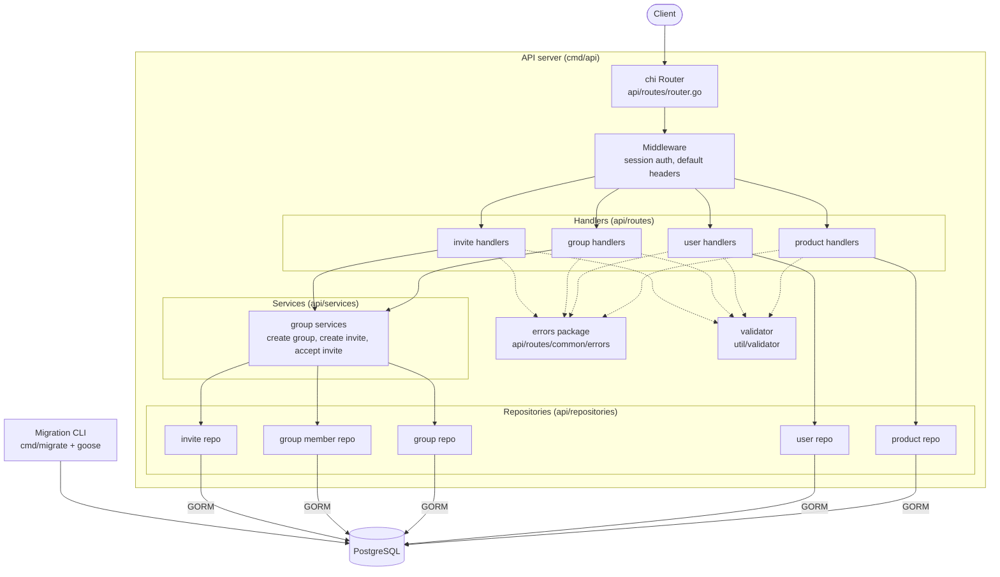

# Architecture

The API follows a layered design: HTTP handlers deal with requests and responses, services hold business logic that spans more than one entity, and repositories wrap all database access. Simple domains (products, users) skip the service layer and call their repository directly from the handler.

## Layers

- **Router** (`api/routes/router.go`): mounts everything under `/v1`, splits routes into a public group (register, login) and an authenticated group behind the session middleware. `GET /livez` is the health check.
- **Middleware** (`api/middleware`): `RequireAuth` reads the `auth-session` cookie (gorilla/sessions), puts the user id into the request context, and refreshes the session expiration on each request.
- **Handlers** (`api/routes/<domain>`): decode and validate input, call a repository or service, and write responses. All error responses go through the shared errors package, which produces a single JSON shape with machine-readable codes.
- **Services** (`api/services/group`): business logic for groups and invites, using transactions (`services/util.WithTransaction`) and returning sentinel errors that handlers map to HTTP statuses with `errors.Is`.
- **Repositories** (`api/repositories`): all GORM queries. Models live separately in `api/model`.
- **Migrations** (`migrations/`, `cmd/migrate`): goose SQL migrations run by a small CLI, executed automatically in the Docker Compose setup.

## Cross-cutting pieces

- **Errors** (`api/routes/common/errors`): `{"errors": [{code, detail, meta}]}` for every error response, plus Postgres error classification (duplicate key becomes 409, foreign key violation becomes 422).
- **Validation** (`util/validator`): go-playground/validator with a custom `alphaspace` rule; failures are converted into error items with per-rule codes and the offending field in `meta`.
- **Config** (`config/`): strict env-based configuration via envdecode. Every variable is required.
