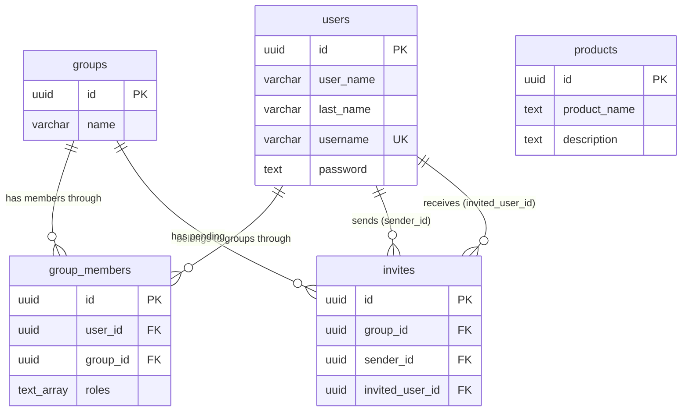

# Current state

A snapshot of what the API does today (September 2026).

## Implemented features

- **Users and auth**: registration, login, and logout with cookie-based sessions (gorilla/sessions). Passwords are validated against the stored credentials on login; sessions expire after a configurable max age and are refreshed on each authenticated request.
- **Products**: full CRUD (list, get, create, update, delete). List and get are wired into the router; update and delete handlers exist but are not routed yet.
- **Groups**: an authenticated user can create a group and becomes its owner.
- **Invites**: a group owner can invite another user to the group, and the invited user can accept, which creates the membership and deletes the invite inside a transaction.

## Endpoints

| Method | Path | Auth | Handler |
|--------|------|------|---------|
| GET | `/livez` | No | Health check |
| POST | `/v1/users` | No | Register |
| POST | `/v1/users/login` | No | Login |
| POST | `/v1/users/logout` | Yes | Logout |
| GET | `/v1/users/{id}` | Yes | Get user |
| GET | `/v1/products` | Yes | List products |
| GET | `/v1/products/{id}` | Yes | Get product |
| POST | `/v1/products` | Yes | Create product |
| POST | `/v1/groups` | Yes | Create group |
| POST | `/v1/groups/{groupId}/invites` | Yes | Create invite |
| POST | `/v1/groups/{groupId}/invites/accept` | Yes | Accept invite |

## Error handling

All errors use one JSON shape:

```json
{
  "errors": [
    {
      "code": "INVALID_UUID",
      "detail": "the provided id is not a valid UUID",
      "meta": { "field": "id" }
    }
  ]
}
```

Codes are defined in `api/routes/common/errors`. Statuses follow the failure type: 400 for malformed input, 401 for auth failures (including unknown username on login, to avoid leaking account existence), 403 for permission problems, 404 with entity-specific codes, 409 for duplicates (such as `USERNAME_TAKEN` or `ALREADY_INVITED`), 422 for validation and foreign key violations, and 500 only for genuine server faults. The group service layer uses sentinel errors so handlers map failures with `errors.Is`.

## Database

PostgreSQL with goose SQL migrations (`migrations/`). All tables use UUID primary keys and soft deletes via `deleted_at`.

### Entity relationships



- **users and groups** form a many-to-many relationship through `group_members`, which also carries the member's roles (`owner`, `member`) as a Postgres text array. A user can join a group only once (`UNIQUE (user_id, group_id)`).
- **invites** connect a group to two users: the sender (`sender_id`) and the invited user (`invited_user_id`). A user can have only one pending invite per group (`UNIQUE (group_id, invited_user_id)`). Accepting an invite creates the `group_members` row and deletes the invite in one transaction.
- All foreign keys cascade on delete, though in practice rows are soft deleted rather than removed.
- **products** stand alone: they have no foreign key to users or groups yet, so every product is currently global rather than belonging to a shopping list, group, or user. Connecting products to groups is the most likely next schema change.

## Testing

Thin coverage so far: one test file (`api/repositories/product/product_repository_test.go`) using go-sqlmock. Handlers and services have no tests yet.

## Known gaps and TODOs

- Product update and delete handlers are implemented but not registered in the router.
- Invite creation is not idempotent; inviting an already-invited user returns 409 instead of returning the existing invite.
- Login has a TODO to mitigate timing attacks on username lookup.
- Logging is minimal (a few `fmt.Println` calls); there is no structured logging or request tracing.
- No list endpoints for groups, group members, or invites yet.
