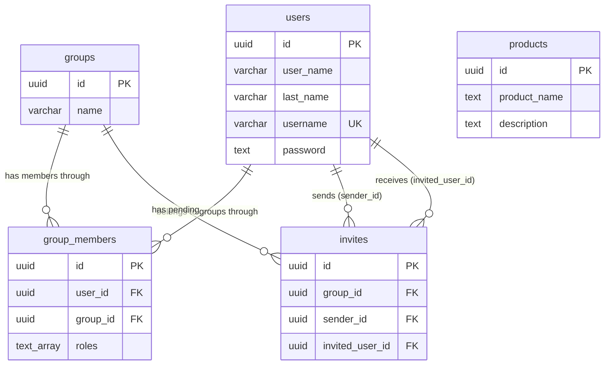
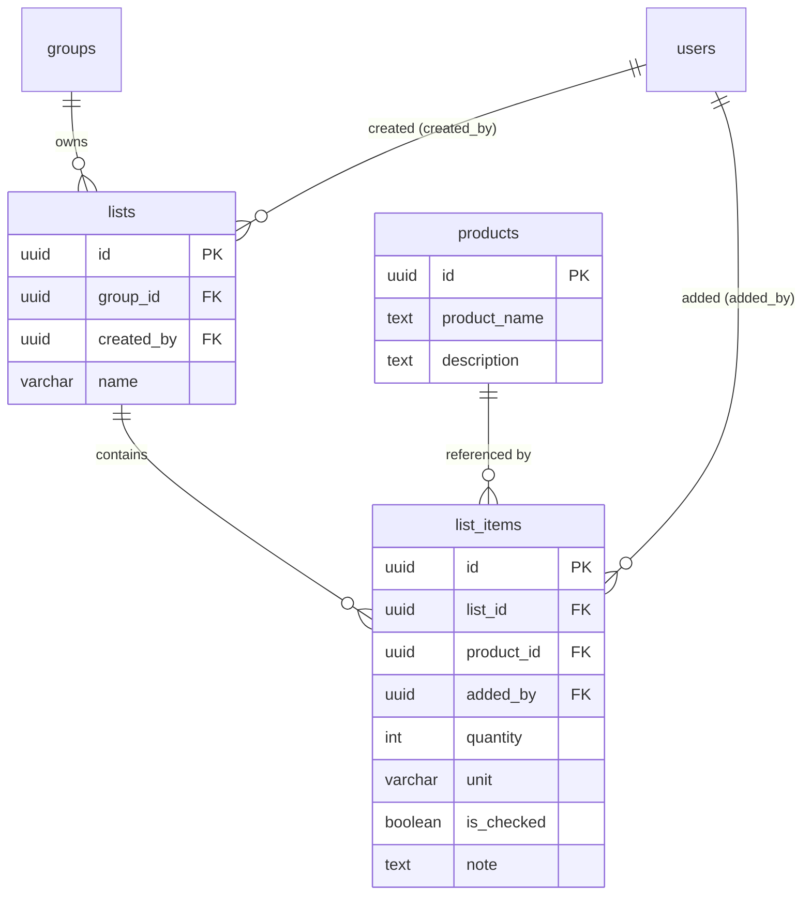

# Current state

A snapshot of what the API does today (September 2026).

## Implemented features

- **Users and auth**: registration, login, and logout with cookie-based sessions (gorilla/sessions). Passwords are validated against the stored credentials on login; sessions expire after a configurable max age and are refreshed on each authenticated request.
- **Products**: full CRUD (list, get, create, update, delete). List and get are wired into the router; update and delete handlers exist but are not routed yet.
- **Groups**: an authenticated user can create a group and becomes its owner.
- **Invites**: a group owner can invite another user to the group, and the invited user can accept, which creates the membership and deletes the invite inside a transaction.

## Endpoints

| Method | Path | Auth | Handler |
|--------|------|------|---------|
| GET | `/livez` | No | Health check |
| POST | `/v1/users` | No | Register |
| POST | `/v1/users/login` | No | Login |
| POST | `/v1/users/logout` | Yes | Logout |
| GET | `/v1/users/{id}` | Yes | Get user |
| GET | `/v1/products` | Yes | List products |
| GET | `/v1/products/{id}` | Yes | Get product |
| POST | `/v1/products` | Yes | Create product |
| POST | `/v1/groups` | Yes | Create group |
| POST | `/v1/groups/{groupId}/invites` | Yes | Create invite |
| POST | `/v1/groups/{groupId}/invites/accept` | Yes | Accept invite |

## Error handling

All errors use one JSON shape:

```json
{
  "errors": [
    {
      "code": "INVALID_UUID",
      "detail": "the provided id is not a valid UUID",
      "meta": { "field": "id" }
    }
  ]
}
```

Codes are defined in `api/routes/common/errors`. Statuses follow the failure type: 400 for malformed input, 401 for auth failures (including unknown username on login, to avoid leaking account existence), 403 for permission problems, 404 with entity-specific codes, 409 for duplicates (such as `USERNAME_TAKEN` or `ALREADY_INVITED`), 422 for validation and foreign key violations, and 500 only for genuine server faults. The group service layer uses sentinel errors so handlers map failures with `errors.Is`.

## Database

PostgreSQL with goose SQL migrations (`migrations/`). All tables use UUID primary keys and soft deletes via `deleted_at`.

### Entity relationships


```mermaid
erDiagram
    users ||--o{ group_members : "belongs to groups through"
    groups ||--o{ group_members : "has members through"
    groups ||--o{ invites : "has pending"
    users ||--o{ invites : "sends (sender_id)"
    users ||--o{ invites : "receives (invited_user_id)"

    users {
        uuid id PK
        varchar user_name
        varchar last_name
        varchar username UK
        text password
    }

    groups {
        uuid id PK
        varchar name
    }

    group_members {
        uuid id PK
        uuid user_id FK
        uuid group_id FK
        text_array roles
    }

    invites {
        uuid id PK
        uuid group_id FK
        uuid sender_id FK
        uuid invited_user_id FK
    }

    products {
        uuid id PK
        text product_name
        text description
    }
```

- **users and groups** form a many-to-many relationship through `group_members`, which also carries the member's roles (`owner`, `member`) as a Postgres text array. A user can join a group only once (`UNIQUE (user_id, group_id)`).
- **invites** connect a group to two users: the sender (`sender_id`) and the invited user (`invited_user_id`). A user can have only one pending invite per group (`UNIQUE (group_id, invited_user_id)`). Accepting an invite creates the `group_members` row and deletes the invite in one transaction.
- All foreign keys cascade on delete, though in practice rows are soft deleted rather than removed.
- **products** stand alone: they have no foreign key to users or groups, so every product is a shared, global catalog entry. The planned lists and items (below) connect products to groups without changing that: products stay a generic catalog (Milk, Eggs), and the group-specific data lives in the new tables.

## Planned: shopping lists and items

Proposed, not yet implemented, documented here for review. This is the next feature: give groups something to do by letting them own shopping lists made of items, where each item points at a product from the shared catalog.

Two new tables, following the existing conventions (UUID primary keys, timestamps, soft deletes):

- **lists**: a shopping list that belongs to exactly one group. A group can have many lists (for example "Weekly groceries" and "Party supplies"), and a list cannot exist outside a group: `group_id` (FK to groups) is mandatory (`NOT NULL`), so there are no ownerless lists. Other fields: `name` and `created_by` (FK to users, who made it).
- **list_items**: a single line on a list. It belongs to exactly one list and references one product from the shared catalog. Fields: `list_id` (FK to lists), `product_id` (FK to products), `quantity` (default 1), `unit` (optional, such as "kg" or "L"), `is_checked` (default false, so members can tick items off while shopping), `added_by` (FK to users), and an optional `note`.


```mermaid
erDiagram
    groups ||--o{ lists : "owns"
    lists ||--o{ list_items : "contains"
    products ||--o{ list_items : "referenced by"
    users ||--o{ lists : "created (created_by)"
    users ||--o{ list_items : "added (added_by)"

    lists {
        uuid id PK
        uuid group_id FK
        uuid created_by FK
        varchar name
    }

    list_items {
        uuid id PK
        uuid list_id FK
        uuid product_id FK
        uuid added_by FK
        int quantity
        varchar unit
        boolean is_checked
        text note
    }

    products {
        uuid id PK
        text product_name
        text description
    }
```

### Design decisions filled in (please review)

- **Products stay a shared catalog.** They are not scoped to a group; any group's items can reference any product. This keeps the catalog generic and reusable. Open question: do we ever want group-private or custom products? If so, that is a later addition, not part of this step.
- **One line per product per list.** A `UNIQUE (list_id, product_id)` constraint means a product appears at most once on a given list. Adding a product that is already there should bump its `quantity` rather than create a duplicate row (idempotent add). Open question: is that the behavior you want, or should duplicates be allowed?
- **Delete behavior.** Deleting a group cascades to its lists, and deleting a list cascades to its items, matching the existing `ON DELETE CASCADE` convention. For the product reference the cleaner choice is `ON DELETE RESTRICT` (do not allow hard-deleting a product that is still on a list), since products are a shared catalog and are normally soft deleted anyway. Open question: RESTRICT or CASCADE here?
- **Checked state is a boolean.** `is_checked` covers ticking items off while shopping. If we later need more states (for example pending, purchased, out of stock) this becomes a status enum, but a boolean is enough to start.
- **Access control.** Group membership is required to create a list in a group, and only members of the owning group can read or modify that group's lists and items. Non-members get a 403. This is a firm rule, not an open question; it is enforced in the service layer the same way invites already check membership, so it rides on the broader access-control work.

## Testing

Thin coverage so far: one test file (`api/repositories/product/product_repository_test.go`) using go-sqlmock. Handlers and services have no tests yet.

## Known gaps and TODOs

- Product update and delete handlers are implemented but not registered in the router.
- Invite creation is not idempotent; inviting an already-invited user returns 409 instead of returning the existing invite.
- Login has a TODO to mitigate timing attacks on username lookup.
- Logging is minimal (a few `fmt.Println` calls); there is no structured logging or request tracing.
- No list endpoints for groups, group members, or invites yet.
